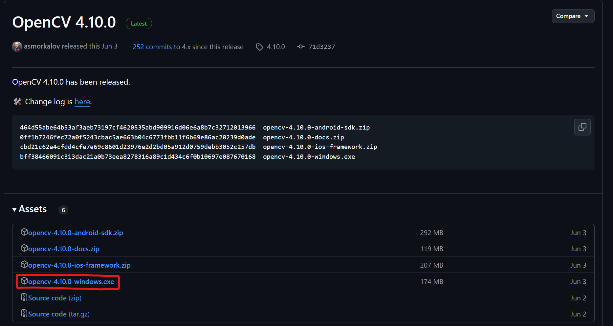
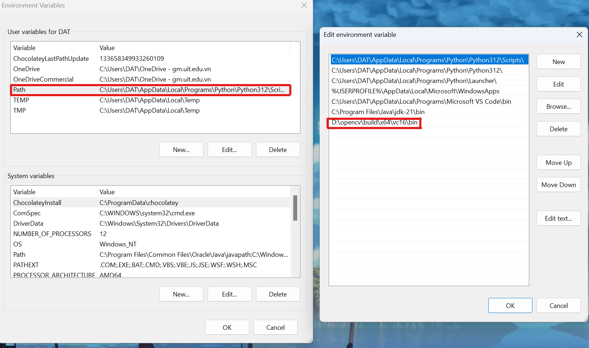
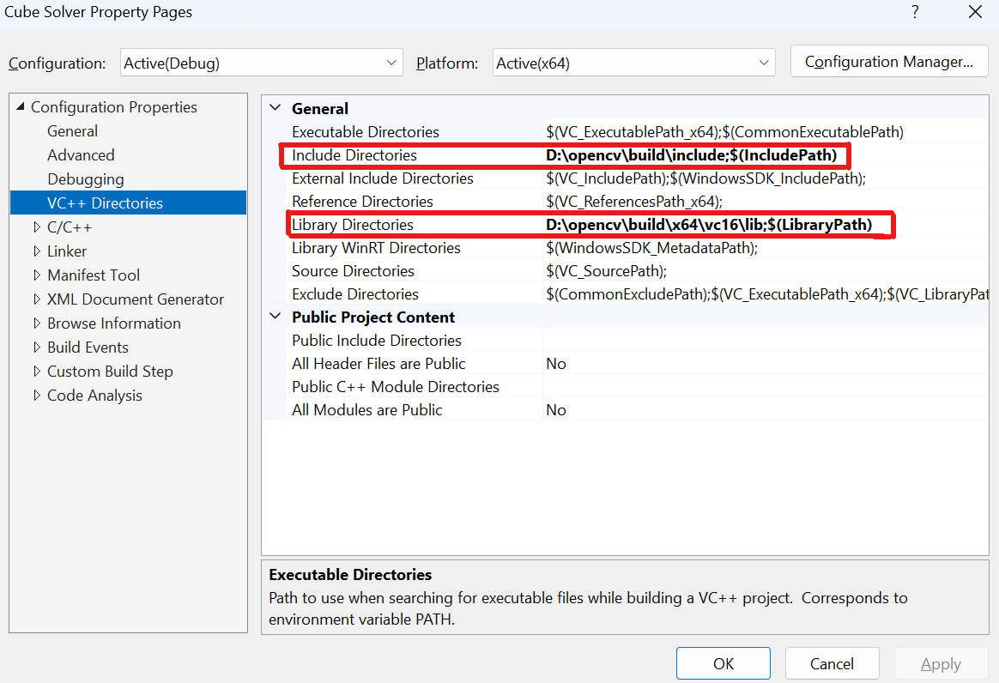
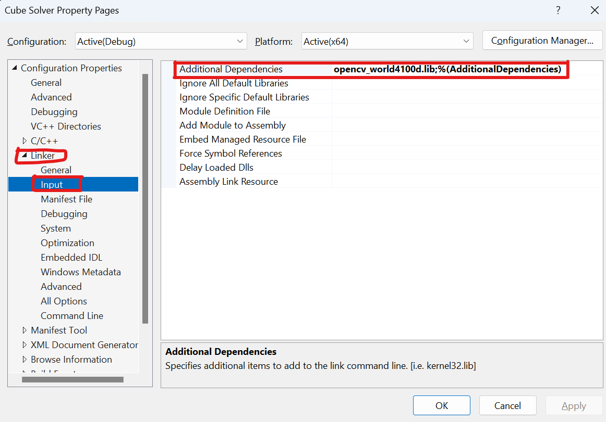

# Cube Solver Using CFOP and OpenCV

## About The Project

This project solves the Rubik's Cube using the CFOP method with real-time color detection implemented in C++ and OpenCV. The cube's state is captured using a webcam, and the CFOP algorithm solves it step by step. The project also provides a visualization of the cube's current state and the solving process.

## Features

- **Real-time Color Detection**: Detects the colors of the cube's faces using a webcam.
- **CFOP Algorithm Implementation**: Solves the Rubik's Cube using the Cross, F2L, OLL, and PLL stages.
- **Live Cube Visualization**: Displays the cube's state in real-time as it is being solved.

## Getting Started

To get started, ensure you have the necessary hardware and software. This project detects the Rubik's Cube using your webcam and solves it in real-time using the CFOP algorithm.

### System Requirements 

- **Programming Language**: C++
- **Libraries**:
  - OpenCV
  - Standard Template Library (STL)
- **Hardware**: Webcam for real-time cube detection

### Installation

1. **Clone the repo**:

    ``` bash
    git clone https://github.com/EitoTi/cube-solver-cfop.git
    ```

2. **Install OpenCV**:
  - ##### **Step 1:**
    - Go to https://github.com/opencv/opencv and download the Lastest Release
    - Extract Files to local drive e.g. D:

      

  - ##### **Step 2:**
    - Add bin folder to the Environment Variables path
  
      ``` bash
      D:\opencv\build\x64\vc16\bin
      ```
    - Restart computer
        

3. **Set up Visual Studio 2022**
  - ##### **Step 1:**
    - Launch Visual Studio 2022
  - ##### **Step 2:** Open Existing Project
    ```File > Open > Project/Solution``` and select your ```Cube Solver.sln``` file.
  - ##### **Step 3:** Configure OpenCV in Visual Studio:
    Add Directories by going to Project-Properties-Configuration Properties-

    VC++ Directories
      1. Add Build Directories: ```D:\opencv\build\include```
      2. Add Library Directories: ```D:\opencv\build\x64\vc16\lib```
    Linker Input 
      3. Add Linker input: ```opencv_world4100d.lib```
        d for debug without d for release 

      

      

4. **Run the Project**
  - Press F5 to run the project
  
### **Usage**

1. **Position the Cube**: Place the Rubik's Cube in front of the camera, ensuring all sides are visible.
2. **Real-time Color Detection**: The program captures the colors of the cube in real-time. You can interact with the program using the following key commands:
   - Press ```s```: Save the current state of the cube during real-time detection. This stores the detected colors.
   - Press ```r``` Rescan the cube's colors if the detection is not accurate or you want to re-capture the colors.
   - Press ```q```: Begin the solving process once all colors have been accurately detected and saved.
3. **Solve the Cube**:
   - After pressing ```q```, the CFOP algorithm will start solving the cube.
4. **Apply the Solution**: Once the solution has been generated, press any key to apply the solution.

## License

This project is licensed under the MIT License. See the [LICENSE](./LICENSE) file for more details.
